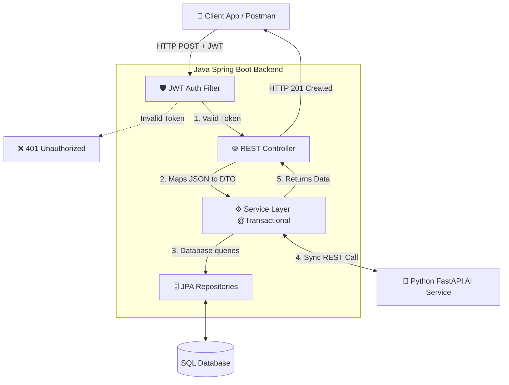
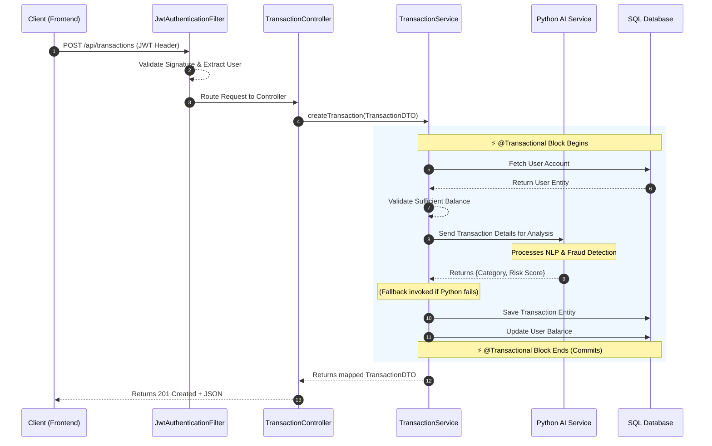

# 🚀 The Main Request Flow: Spring Boot Backend

When an interviewer asks, **"Can you explain the main lifecycle of a request in your application?"**, they want to see if you understand the layered architecture of Spring Boot and how your specific components (like the JWT Filter and the Python AI Service) fit into that flow.

Here is the entire end-to-end flow of a transaction request in your application, visualized and explained simply.

---

## 1. High-Level Architecture Diagram

This flowchart shows how the major components interact from the moment a user makes a request to the moment a response is returned.

---

## 2. Sequence Diagram: Creating a Transaction

This sequence diagram breaks down the **Time Progression** of the exact steps taken when a user attempts to create a new bank transaction.

---

## 3. Step-by-Step Explanation for Interviews

If you need to talk through this verbally in an interview, here is your script.

### Step 1: Security & Interception (`JwtAuthenticationFilter`)
> "Every incoming request first hits my **JWT Authentication Filter**. It intercepts the HTTP request, strips the Bearer token from the header, and cryptographically verifies the token using an HS256 secret key. If valid, it extracts the username and sets the user's principal in the `SecurityContextHolder` so the rest of the application knows who is making the request."

### Step 2: Routing & Presentation (`TransactionController`)
> "Once authenticated, Spring's DispatcherServlet routes the request to the `TransactionController`. The Controller's only job is to deserialize the incoming JSON payload into a Java Data Transfer Object (`TransactionDTO`) and pass it down to the Service layer. I keep my controllers very thin."

### Step 3: Business Logic & The Transaction Boundaries (`TransactionService`)
> "The request enters the `TransactionService`. This method is annotated with `@Transactional`, meaning if anything fails during this process, all database changes revert automatically to prevent partial money transfers. First, it queries the `UserRepository` to retrieve the user and verifies they have enough money in their balance."

### Step 4: The Microservice Bridge (`Python AI Service`)
> "Next, the Java service acts as an HTTP client and makes a synchronous call to my **Python FastAPI Microservice**. It passes the transaction description. The Python service runs machine learning models to categorize the transaction and detect fraud, returning a risk score. If the Python service goes down, I have a `try-catch` block that provides gracefully degraded fallback values so the user's transaction isn't blocked."

### Step 5: Data Persistence & Response (`JpaRepository`)
> "Finally, the Java service updates the user's balance and saves the new transaction record to the SQL database using Spring Data JPA. The `@Transactional` block commits successfully. The service maps the saved Database Entities back into safe DTOs and passes them back up to the Controller, which returns an HTTP 201 Created response to the user."
