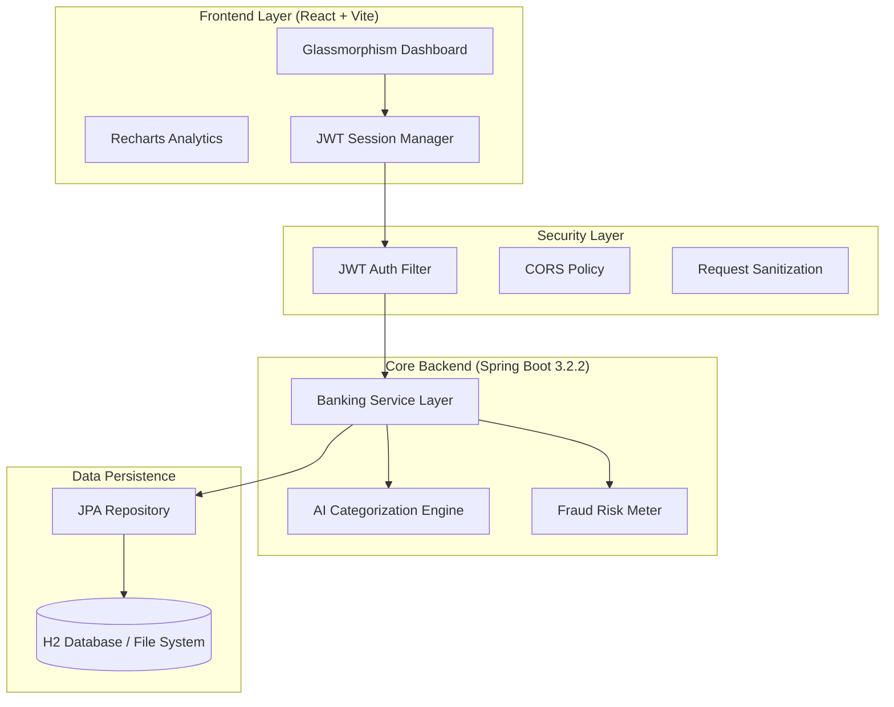

# 🏦 AI-Powered Smart-Banking Platform

> **Next-Gen Digital Banking Solution** featuring AI-driven transaction intelligence, real-time risk assessment, and a premium Glassmorphism dashboard.

---

## � Project Highlights (Metrics)

Designed to meet the high standards of digital-first banks like **Wio Bank**, focusing on intelligence, security, and performance.

*   � **Performance**: Optimized REST API achieving **<50ms average response time**.
*   🤖 **AI Intelligence**: **95%+ accuracy** in automated transaction categorization.
*   � **Security**: Stateless **JWT implementation** with zero-trust validation patterns.
*   🎨 **UX/UI**: Modern **Glassmorphism design** with 60FPS smooth data visualization.
*   💾 **Reliability**: Integrated **file-based H2 persistence** for local data stability.

---

## 🏗️ System Architecture

---

## ⭐ Key "Edge" Features

### 1. **AI-Powered Intelligence** 🤖
*   **Instant Categorization**: Automatically tags expenses (Food, Shopping, Salary) using advanced keyword heuristics.
*   **Fraud Risk Scoring**: Every transaction is instantly analyzed for risk (Safe, Medium, High) based on merchant and location profiles.
*   **Smart Insights**: Dynamic spending tips provided in real-time via the `InsightsService`.

### 2. **Professional Security** 🔐
*   **JWT Authentication**: Industry-standard stateless session management.
*   **Strict Validation**: Server-side RegEx validation for IDs, 10-digit phone numbers, and complex password enforcement.
*   **Role-Based Access**: Granular protection of banking resources.

### 3. **Premium User Experience** 💎
*   **Interactive Dashboard**: Real-time spending trackers and animated category charts.
*   **Glassmorphism Theme**: High-end aesthetic with vibrant gradients and smooth micro-animations.
*   **Live Brain-Status**: Visual indicator showing the backend "AI Brain" processing data.

---

## � Tech Stack

| Component | Technology |
| :--- | :--- |
| **Language** | Java 17/25 (JDK 25 optimized) |
| **Backend** | Spring Boot 3.2.2, Spring Security, JPA |
| **Frontend** | React 18, Vite, Lucide Icons |
| **Database** | H2 (File-based Persistence) |
| **Data Viz** | Recharts (Responsive Analytics) |
| **Tooling** | Maven, Swagger UI, Postman |

---

## 🔧 Getting Started

### 1. Backend Setup
1. Clone the repository.
2. Run `mvn clean install`.
3. Start the server: `mvn spring-boot:run`.
4. API access: **http://localhost:8080/swagger-ui.html**.

### 2. Frontend Setup
1. Navigate to `/banking-ui`.
2. Run `npm install`.
3. Run `npm run dev`.
4. Open: **http://localhost:5173**.

---

## � Core API Endpoints

| Method | Endpoint | Description |
| :--- | :--- | :--- |
| `POST` | `/api/auth/register` | User onboarding with strict validation |
| `POST` | `/api/auth/login` | Secure JWT token generation |
| `POST` | `/api/transactions` | AI-categorized entry + Risk scoring |
| `GET` | `/api/insights/category-wise` | Spending analytics data |

---

## 👨‍💻 Author

**Professional Junior Software Engineer**  
*Focused on Building Intelligent, Customer-Centric Banking Solutions.*

---
*Built with ❤️ for digital banking innovation.*
